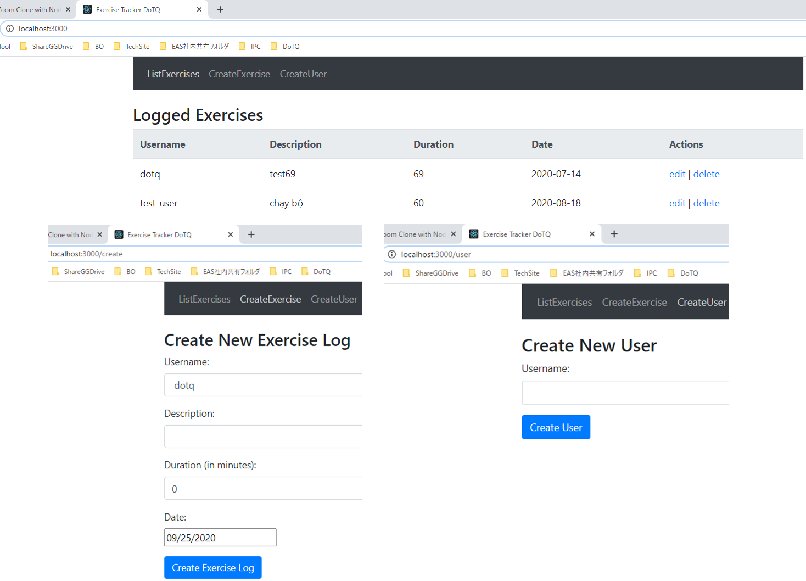
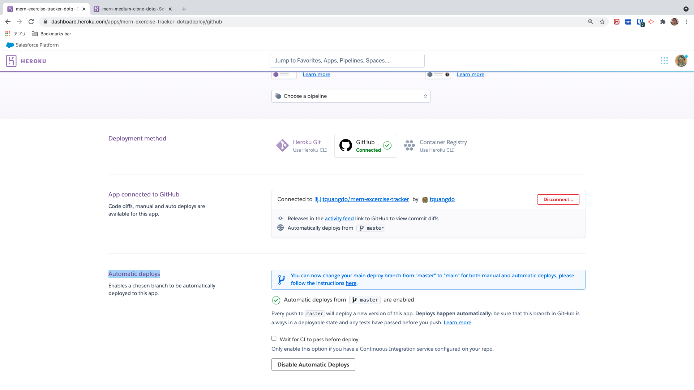
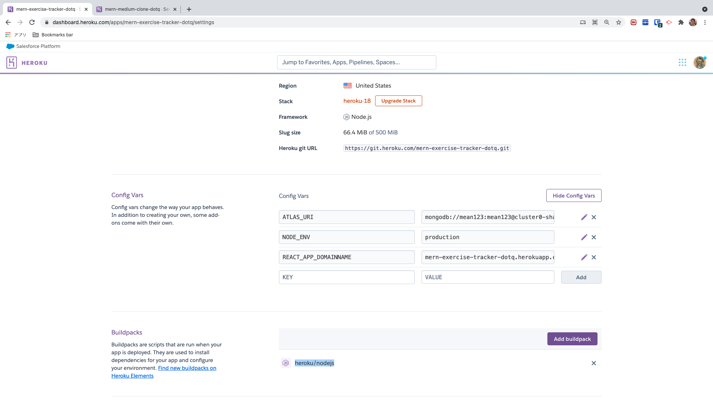
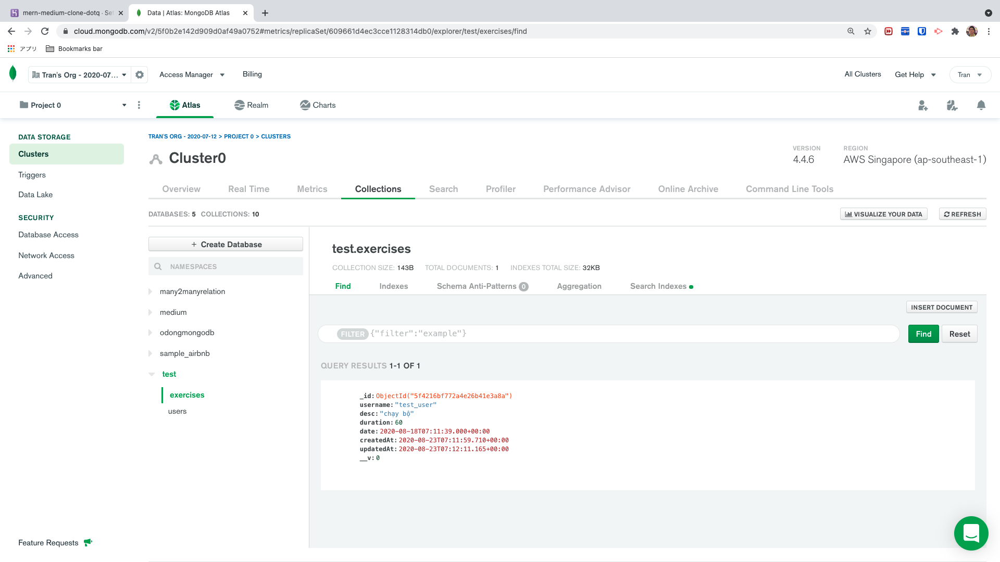
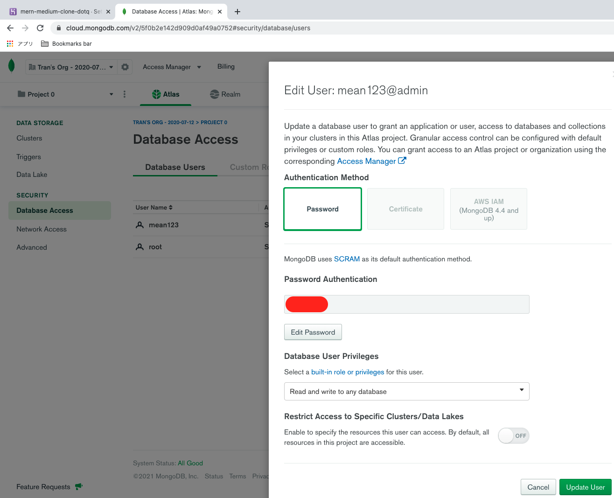

# mern-excercise-tracker 🚀

[](https://github.com/tquangdo/mern-excercise-tracker/issues/new)
***********


## deploy local
1. `$npm install`
2. 
```js
$cd backend
backend$nodemon server.js
backend$ cd ..
$npm start
```
>OR `$npm run dev`
4. access "localhost:3000"

## heroku

### install
- `npm i -g heroku`
### dashboard on website

***********
### setting
https://github.com/tquangdo/node-zoom-clone-app/blob/master/memo.txt
#### check buildpacks
- `heroku buildpacks -a mern-exercise-tracker-dotq`
- -> `heroku/nodejs`

#### config vars
1. `ATLAS_URI`: https://github.com/tquangdo/mern-excercise-tracker/blob/master/backend/server.js#L12
2. `REACT_APP_DOMAINNAME`: https://github.com/tquangdo/mern-excercise-tracker/blob/master/src/constants/ConfigConst.js

## atlas
- file: https://github.com/tquangdo/mern-excercise-tracker/blob/master/.env
- dbname: `test`

- username: `mean123`

- Network Access: NW Access > IP Whitelist > Add IP address > Whitelist Entry: "0.0.0.0/0"

- Cluster connect: Clusters > Cluster0: Overview > Connect > Connect your application > Driver="Node.js" & Version="2.2.12 OR LATER"!!!

